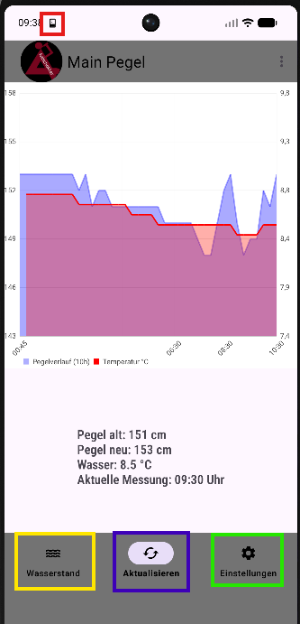
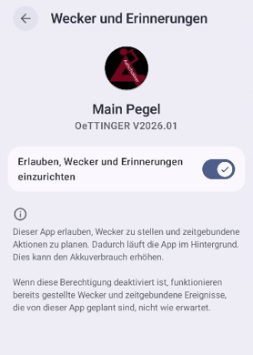
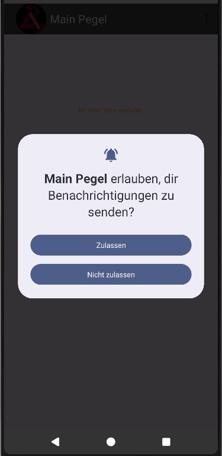
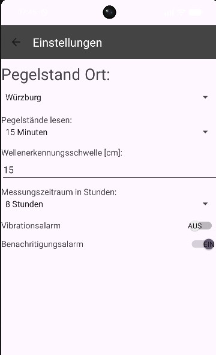
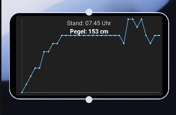

# MainPegel
Liest den Pegelstand von der angegebenen Messstelle aus.
Bei Überschreitung des Pegelstand um x cm wird ein Alarm ausgelöst

  

## Play Store

## Installation
Wichtige Informationen!

### Erinnerungsfunktion
Damit der Pegel gelesen werden kann muss in der APP die Erinnerungsfunktion erlaubt werden!

  

Es wird im Hintergrund ein Wecker gestellt um alle 15, 30, 45,... Minuten den Pegelwert
auszulesen.

### Benachritigungsalarme
Um die Pegelwarnung zu aktivieren ist es notwendig, dass die APP Benachrichtigungen senden darf

  

- Vibrationsalarm
- Benachrichtigungsalarm

## Einstellungen
Es können folgende Einstellungen geändert werden.

  

- Pegelmessstelle (Ort)
- Lesen des Pegels alle x Minuten
- Wellenerkennung bei Steigendem Pegel in cm
    Bei Überschreitung wird der Alarm ausgelöst
- Anzeige des Messzeitraums als Grafik
- Alarme werden bei überschreiten der Welle ausgelöst
    - Vibrationsalarm
    - Benachrichtigungsalarm

## Widgets
Anzeige des Pegels als Grafik und aktueller Pegelmesswert mit der Uhrzeit des zuletzt gemessenen Pegels  

  

## Pegeldaten
Die Pegeldaten werden von folgender API bezogen.

https://www.pegelonline.wsv.de/

## Android Version

- Minimum SDK 32
- Kotlin V2.3.0
- JavaVersion VERSION_17

## Lizenz

Apache License Version 2.0